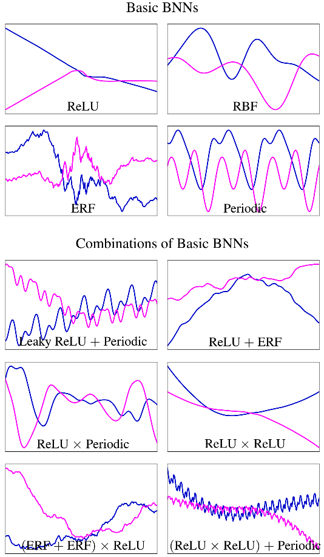

# Expressive_Priors_in_BNNs
Code from UAI 2019 paper 'Expressive Priors in Bayesian Neural Networks: Kernel Combinations and Periodic Functions', Tim Pearce et al.
https://arxiv.org/abs/1905.06076

How can we specify expressive priors in Bayesian deep learning?

## Abstract

A simple, flexible approach to creating expressive priors in Gaussian process (GP) models makes new kernels from a combination of basic kernels, e.g. summing a periodic and linear kernel can capture seasonal variation with a long term trend. Despite a well-studied link between GPs and Bayesian neural networks (BNNs), the BNN analogue of this has not yet been explored. This paper derives BNN architectures mirroring such kernel combinations. Furthermore, it shows how BNNs can produce periodic kernels, which are often useful in this context. These ideas provide a principled approach to designing BNNs that incorporate prior knowledge about a function. We showcase the practical value of these ideas with illustrative experiments in supervised and reinforcement learning settings.

This repo contains all code used to create plots and run experiments. See comments at top of each .py file in /code/ for information about how to run each.

